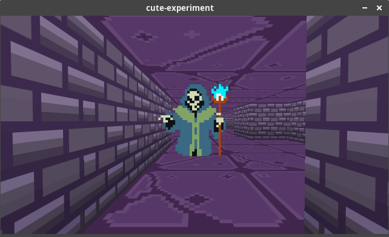

# cute-experiments

[](LICENSE)
[](https://github.com/bullno1/cute-experiments/actions/workflows/build.yml)

Random experiments with [Cute Framework](github.com/RandyGaul/cute_framework).

# Building

`./boostrap` to setup the project

## Linux

```
cmd/linux/watch
cmd/linux/run
```

Code and asset changes will be hot-reloaded.

## Web

```
cmd/web/watch
cmd/web/run
```

## Windows

```
cmd/win/prepare.bat
cmd/win/build.bat
```

# Demos
## dungeon



It's mostly to play around with the new 3D API and test the idea that any 2D pixelated tileset can be used to build a 3D old school dungeon.

Walk around with WASD and QE (turn left/right).

Space will toggle the tile in front between wall and floor.

Z moves the placeholder enemy in front of the camera.

Holding left shift shows the minimap.

## particle

GPU driven particle system with a GLSL-based DSL
